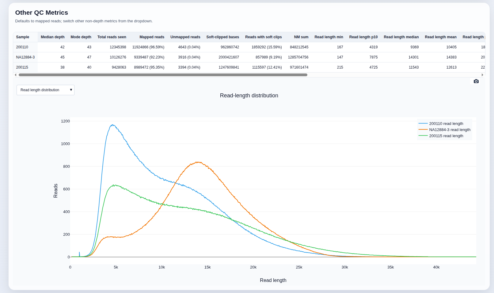
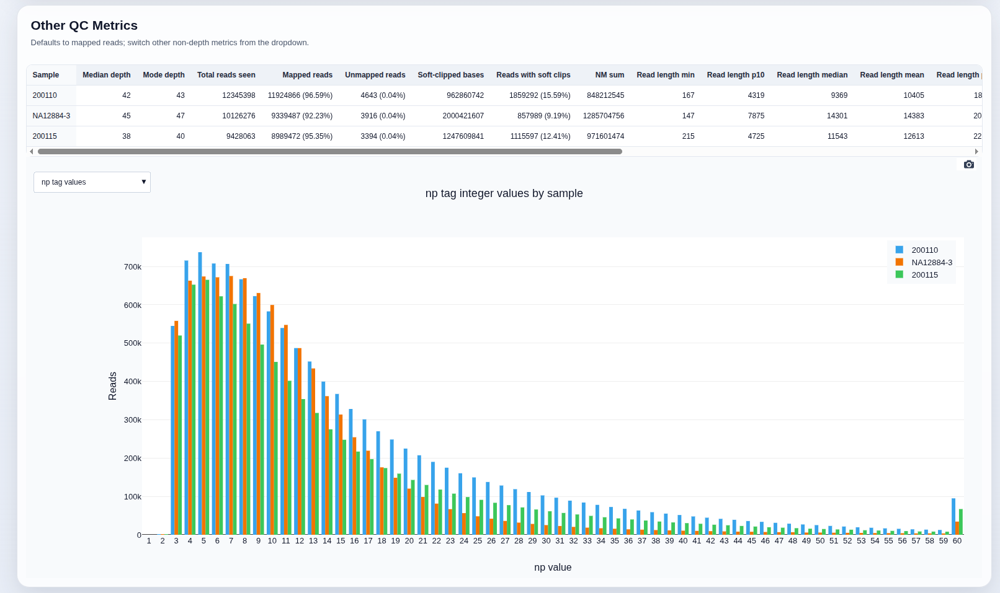
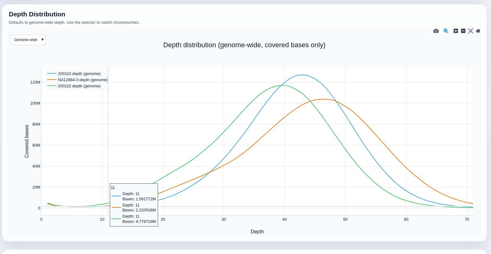

# blammo-qc

`blammo-qc` is a Rust CLI for BAM/CRAM QC that writes:
- an optional JSON metrics report (only when `--output-json` is provided)
- a self-contained interactive Plotly HTML report

It does a full depth pass of each bam/cram.

It is written entirely with ~~vibe coding~~ *agentic-engineering*, written 
with a combination of GPT-5.2 and GPT-5.4 via codex and Opus 4.5 via claude-code`

## Example usage

```bash
blammo-qc \
  --reference ref.fa \
  --tag-bar np \ # (make a bar plot grouped-by sample of the `np` integer tag)
  --tag-line ZX \ # (make a line plot for each sample of the `ZX` tag)
  --output-html blammo.cohort.html \
  sample1.bam sample2.cram 
```

## Example output






